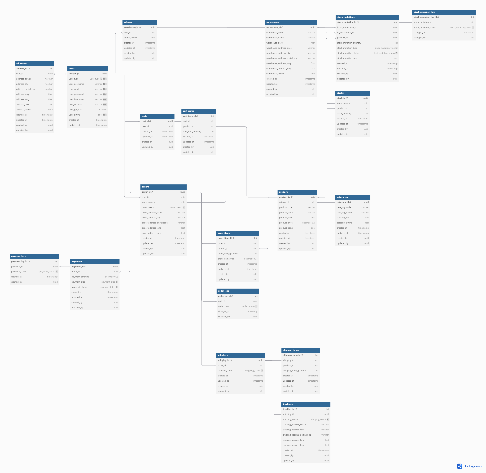

**Database Diagram**

**Q&A**
- get user id login, for autorization? -
- relasi antar aggregate? use materialize or join directly with repository
- dto update only some variable? yes it can
- package name? for easy to use

---

**HOMEWORK**
- implement saga
- try minicube
- try local kubernetes
- try google cloud

---

**LOCAL KUBERNETES**
1. enable kubernetes in docker
2. mvn clean install
3. install helm
4. add cp-helm-charts
5. helm install my-confluent cp-helm-charts
6. kubectl apply -f application-deployment-local.yml
7. kubectl apply -f kafka-client.yml
8. kubectl apply -f postgres-deployment.yml
9. ...

---

**GOOGLE CLOUD**
1. enable kubernetes engine
2. enable artifact registry
3. enable artifact registry API
---
CREATE CLUSTER
4. open cloud shell
5. type: gcloud auth login -> follow the step
   6. if you what change project
      type: gcloud projects list
      type: gcloud config set project PROJECT_ID
7. https://cloud.google.com/compute/docs/regions-zones
8. type: gcloud config set compute/zone asia-southeast2-a
9. type: gcloud container clusters create com-multiwarehouse-app-cluster 
10. connect the cluster

---
CREATE REPOSITORY 
1. Gcloud: Go to Artifact Registry 
2. Gcloud: Create Repository com-multiwarehouse-app-repository

---
CREATE IMAGE & PUSH
1. local: gcloud auth configure-docker asia-southeast2-docker.pkg.dev 
2. local: docker tag com.multiwarehouse.app/warehouse.service:1.0-SNAPSHOT asia-southeast2-docker.pkg.dev/long-canto-439612-d1/com-multiwarehouse-app-repository/warehouse.service:1.0-SNAPSHOT 
3. local: docker push asia-southeast2-docker.pkg.dev/long-canto-439612-d1/com-multiwarehouse-app-repository/warehouse.service:1.0-SNAPSHOT

---
SETUP KAFKA SETTING
1. cloud shell: git clone https://github.com/confluentinc/cp-helm-charts
2. cloud shell: helm install gke-confluent-kafka cp-helm-charts --version 0.6.0
3. if needed: helm uninstall gke-confluent-kafka 
4. if needed: kubectl delete pvc --all 
5. if needed: kubectl delete pv --all

---
APPLY YML
1. cloud shell: git clone https://github.com/ronysetyawanst/com-ecommerce-app-infra.git
2. kubectl apply -f kafka-client.yml 
3. kubectl cp create-topics.sh kafka-client:/kafka-client-storage 
4. kubectl exec -it kafka-client -- /bin/bash 
5. cd ..
6. cd ..
7. cd kafka-client-storage 
8. sh create-topics.sh gke-confluent-kafka-zookeeper-headless 
9. exit 
10. kubectl apply -f postgres-deployment.yml 
11. kubectl apply -f application-deployment.yml 
12. if needed: kubectl delete -f kafka-client.yml 
13. if needed: kubectl delete -f postgres-deployment.yml 
14. if needed: kubectl delete -f application-deployment.yml
15. if needed: kubectl get -A --field-selector 'status.phase==Failed' pods 
16. if needed: kubectl delete -A --field-selector 'status.phase==Failed' pods

---
CHECK RUNNING SERVICE
1. kubectl get all 
2. search : services & ingress
3. go to service

---
CHECK SERVICE LOG
1. kubectl logs warehouse-deployment-78fcc5f8b4-fsfg7
