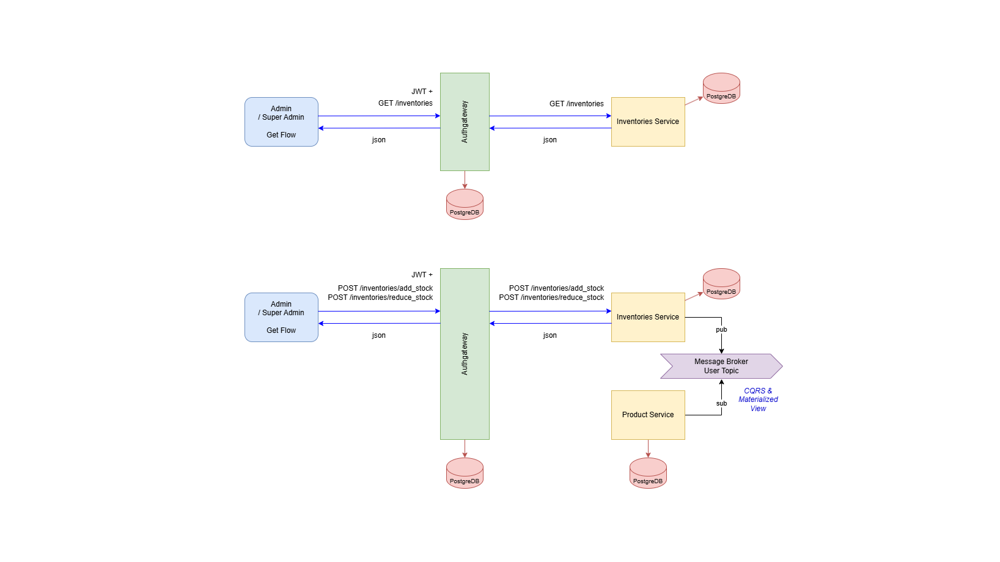
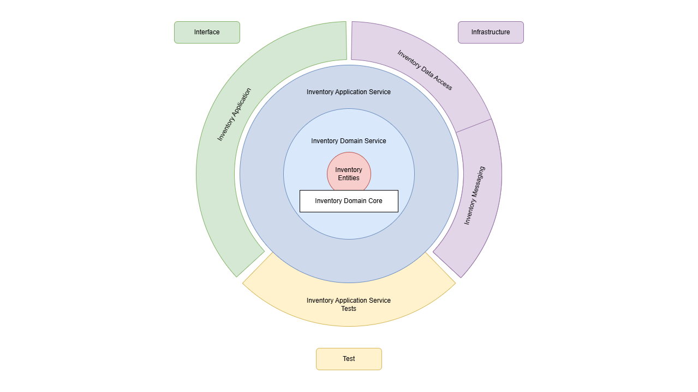
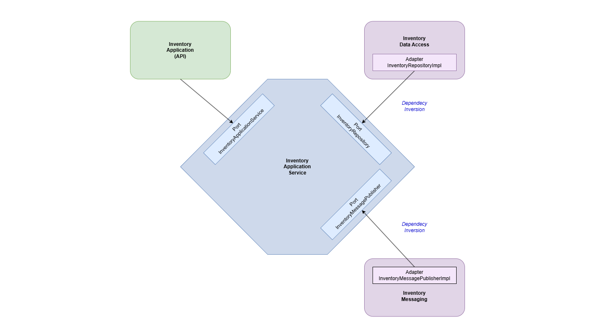

# Multiwarehouse E-Commerce

Multi-Warehouse E-Commerce is a management system that supports multiple warehouses for product storage.

This system enables admins to efficiently manage product stock with stock transfer features between warehouses.

From the user’s perspective, it will not be apparent that the application uses multiple warehouses.

## Technologies Used

- **Backend:** Java Spring
- **Frontend:** Next.js + MUI
- **Database:** PostgreSQL (with materialized view)
- **Authentication:** JWT
- **Message Broker:** Kafka
- **Container:** Docker
- **Container Manager:** Kubernetes
- **Cloud Service:** Google Cloud

---

## Domain Analysis


---

## High-Level-Design


---

## CQRS


---

## Onion Architecture


---

## Hexagonal Architecture


---

## Entity Relation


---

## Low-Level-Design


---

## Domain Core


---
## Dependency Graph


Run the following command to generate the dependency graph:
```sh
mvn com.github.ferstl:depgraph-maven-plugin:aggregate -DcreateImage=true -DreduceEdges=false -Dscope=compile "-Dincludes=com.multiwarehouse.app*:inventory*,com.multiwarehouse.app*:common*"
```

---

## Database Diagram

[View Database Schema](https://dbdiagram.io/d/Multiwarehouse-E-Commerce-675fe033e763df1f000c17e4)

---

# Installation
---
## Google Cloud Setup
Enable the following services before deployment:
1. **Kubernetes Engine**
2. **Artifact Registry**
3. **Artifact Registry API**

---
## Creating a Kubernetes Cluster
1. Open **Cloud Shell**
2. Run the following command:
   ```sh
   gcloud auth login
   ```
   Follow the steps to authorize.
3. If you need to switch projects:
   ```sh
   gcloud projects list
   gcloud config set project PROJECT_ID
   ```
4. Select a regional zone:
   ```sh
   gcloud config set compute/zone asia-southeast2-a
   ```
5. Create a Kubernetes cluster:
   ```sh
   gcloud container clusters create com-multiwarehouse-app-cluster
   ```
6. Connect the cluster to Cloud Shell.

---
## Creating an Artifact Registry Repository
1. Go to **Artifact Registry** in Google Cloud.
2. Create a repository named **com-multiwarehouse-app-repository**.

---
## Build & Push Docker Image
1. Configure Docker with Google Cloud:
   ```sh
   gcloud auth configure-docker asia-southeast2-docker.pkg.dev
   ```
2. Tag the local image:
   ```sh
   docker tag com.multiwarehouse.app/warehouse.service:1.0-SNAPSHOT asia-southeast2-docker.pkg.dev/long-canto-439612-d1/com-multiwarehouse-app-repository/warehouse.service:1.0-SNAPSHOT
   ```
3. Push the image to the repository:
   ```sh
   docker push asia-southeast2-docker.pkg.dev/long-canto-439612-d1/com-multiwarehouse-app-repository/warehouse.service:1.0-SNAPSHOT
   ```

---
## Kafka Setup
1. Go to infrastructure/kubernetes folder:
   ```sh
   cd infrastructure/kubernetes
   ```
2. Or clone the Helm Chart Kafka repository:
   ```sh
   git clone https://github.com/confluentinc/cp-helm-charts
   ```
3. Install Kafka on Kubernetes:
   ```sh
   helm install gke-confluent-kafka cp-helm-charts --version 0.6.0
   ```
4. If needed, uninstall Kafka:
   ```sh
   helm uninstall gke-confluent-kafka
   kubectl delete pvc --all
   kubectl delete pv --all
   ```

---
## Apply YAML Configuration
1. Go to infrastructure/kubernetes folder:
   ```sh
   cd infrastructure/kubernetes
   ```
2. Apply the configuration to the cluster:
   ```sh
   kubectl apply -f kafka-client.yml
   kubectl cp create-topics.sh kafka-client:/kafka-client-storage
   kubectl exec -it kafka-client -- /bin/bash
   cd ..
   cd ..
   cd kafka-client-storage
   sh create-topics.sh gke-confluent-kafka-cp-zookeeper-headless
   exit
   kubectl apply -f postgres-deployment.yml
   kubectl apply -f application-deployment-gke.yml
   ```
3. If needed, remove the configuration:
   ```sh
   kubectl delete -f kafka-client.yml
   kubectl delete -f postgres-deployment.yml
   kubectl delete -f application-deployment-gke.yml
   ```

---
## Monitoring & Logging
### Check Running Services
```sh
kubectl get all
```
Look for **Services & Ingress** to see the running services.

### Check Service Logs
```sh
kubectl logs warehouse-deployment-78fcc5f8b4-fsfg7
```

---
## Horizontal Pod Autoscaler (HPA)
Use the following command to enable auto-scaling based on CPU usage:
```sh
kubectl autoscale deployment inventory-service --cpu-percent=50 --min=1 --max=10
kubectl get hpa
kubectl get hpa inventory-service --watch
```

---
## Running Kubernetes Locally
1. Enable Kubernetes in Docker.
2. Build the application:
   ```sh
   mvn clean install
   ```
3. Install Helm if not already installed.
4. Go to infrastructure/kubernetes folder:
   ```sh
   cd infrastructure/kubernetes
   ```
5. Add the Helm Chart for Kafka:
   ```sh
   helm install local-confluent-kafka cp-helm-charts
   ```
6. Apply local configurations:
   ```sh
   kubectl apply -f kafka-client.yml
   kubectl apply -f postgres-deployment.yml
   kubectl apply -f application-deployment-local.yml
   ```

---
## Additional Notes
- If any **pod fails**, use:
  ```sh
  kubectl get -A --field-selector 'status.phase==Failed' pods
  kubectl delete -A --field-selector 'status.phase==Failed' pods
  ```

---
## License
This project is licensed under the **MIT License**.

---
**Author:** Sulistyo Ponco Nugroho
